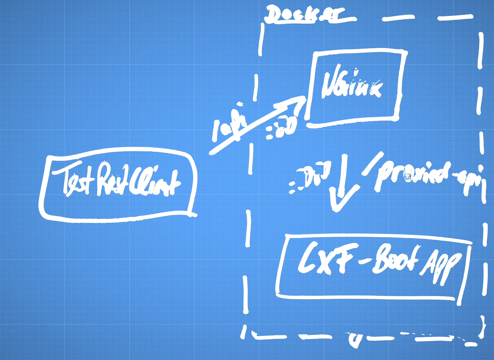

# cxf-spring-boot-starter-system-tests
System Tests for the [cxf-spring-boot-starter](https://github.com/codecentric/cxf-spring-boot-starter) including a reverse proxy and the Spring Boot project using the starter both inside [Docker](https://www.docker.com/) Containers, run with [testcontainers-java](https://github.com/testcontainers/testcontainers-java).

Here you can find the infrastructure for the current setup:

### HowTo

First run `mvn clean package` which will generate all necessary class files with the help of the cxf-spring-boot-starter-maven-plugin and then generate the needed `target/cxf-spring-boot-starter-system-tests-1.1.1-SNAPSHOT.jar` (Otherwise [you´ll get a FileNotFound](https://github.com/marcopaga/cxf-spring-boot-starter-system-tests/issues/2)).

Now you should be able to run the Test [WeatherServiceEndpointIT.java](https://github.com/marcopaga/cxf-spring-boot-starter-system-tests/blob/master/src/test/java/de/codecentric/cxf/endpoint/WeatherServiceEndpointIT.java) inside Intellij.
